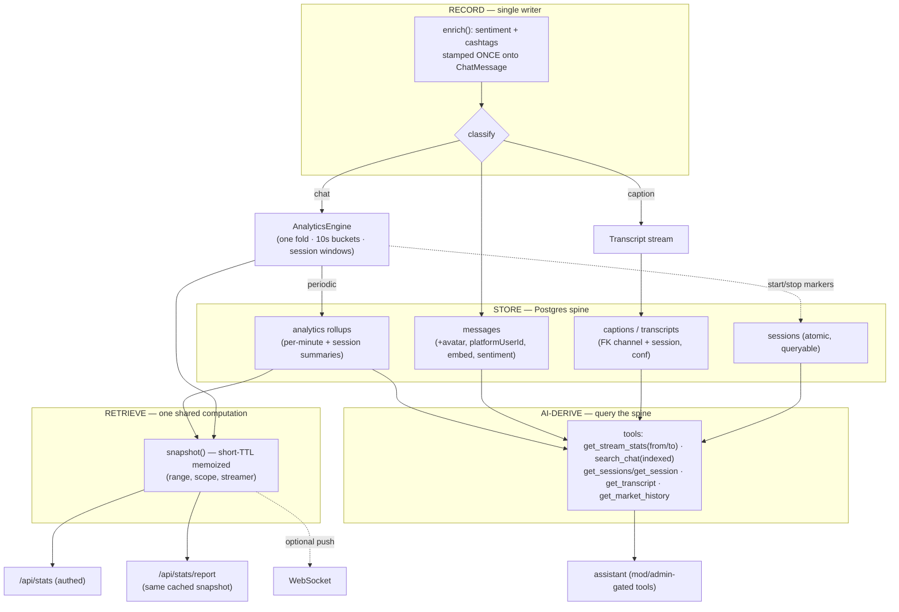

# Analytics — Audit & Redesign

> Audit of how MarketBubble records, stores, retrieves, and AI-derives analytics
> (live stats, manual recording, transcripts). Findings verified against source.

## TL;DR — why it feels messy

There are **four overlapping engines computing the same things from the same message
stream, with no single source of truth and no coherent data lifecycle.**

- The same `ChatMessage` is folded **twice** — `StatsAggregator` (10s buckets, 6h, caps 5000/500)
  and `SessionRecorder` (60s buckets, 24h, caps 4000/300) — with **different widths, caps, and
  eviction rules**, so "session" numbers and "live" numbers for the same window legitimately disagree.
- **Sentiment is scored three times** on the same text (StatsAggregator, SessionRecorder, the
  side-band gauge) and **never stored** on the message — while cashtags (same lifecycle) *are* stored.
- **Durability is incoherent.** Live stats are RAM-only and survive a restart *only if Postgres
  happens to be configured*; recording sessions live in a separate JSON file rewritten whole
  (non-atomic — a crash mid-write corrupts it); the Postgres table grows forever; and the PG schema
  silently drops `avatarUrl`, `platformUserId`, and AI embeds, so messages render differently
  before vs after a restart.
- **The AI is blind to the data that exists.** It sees only the rolling 6h RAM window + the 1200
  newest ring messages. It cannot read durable session history, transcripts, the indexed chat
  search, or price history — even though all are wired into the server one line away.
- **Captions pollute everything.** STT captions are folded into chat analytics as a synthetic
  `transcript` chatter, inflating volume/rate/sentiment in both live stats and saved reports.
- **Demo data shipped as live.** The owned-streamer set on disk is the DEMO seed (Jynxzi/ESL CS);
  the real `PROD_SEED` (Ansem/FazeBanks) is dead-coded.

---

## Verified concrete bugs (the "stop the bleeding" set)

| # | Bug | Evidence | Impact |
|---|---|---|---|
| 1 | Owned-streamer set isn't config-driven; a stale `streamers.json` silently shadows seed changes | `streamers.ts` hard-codes the owned set; `load()` unions persisted over seed by id, so old entries linger | Swapping the owned set needs a code edit **and** a manual file delete — error-prone (the owned set is intentionally the live channels for now: Jynxzi/ESL CS on Twitch + SoloMission on Kick) |
| 2 | Captions folded into chat analytics | `StatsAggregator.record:121-123` & `SessionRecorder.record:54` filter `post`/`mb` but **not** `caption` | Inflated msgs, per-min, chatters, sentiment everywhere |
| 3 | `/api/stats` + `/api/stats/report` unauthenticated | `router.ts:398,403` — no `userFromReq` (every other route has it) | Open analytics read + `pdflatex` DoS |
| 4 | In-flight data lost on crash/shutdown | `SessionRecorder.persist()` runs only on `stop()`; graceful shutdown never flushes recordings or the PG write queue | A crash mid-broadcast loses the whole session |
| 5 | AI can't see existing data | `buildTools` (`router.ts:128`) omits `sessions`, `history`, `transcription`; `search_chat` uses `recent({1200})` not the indexed `search()` | "How did last night's stream do?" / "cite a price" → impossible |

---

## Top problems (ranked)

1. **[CRITICAL] Two parallel fold engines + three sentiment passes** over one stream — duplicate,
   divergent, and `SessionRecorder` silently *drops* new entries past a cap (biasing long sessions
   toward whoever arrived first).
2. **[CRITICAL] No single source of truth / incoherent durability** — three independent persistence
   models; the snapshot's `durable` flag describes the chat store, not whether the numbers survived.
3. **[CRITICAL] AI is blind** to durable sessions, transcripts, indexed search, and price history.
4. **[HIGH] Recording is durable for nothing** — it only flips a cosmetic `recording` boolean;
   active sessions are RAM-only with no boot-replay; SIGTERM loses in-flight data.
5. **[HIGH] Captions pollute** both folds (no `caption` guard); worker `conf` is dropped.
6. **[HIGH] Recompute-on-read** — every client recomputes the full snapshot every 7s, no cache, no
   auth; the report endpoint computes a *second, divergent* snapshot so PDF ≠ screen.
7. **[HIGH] Transcripts are second-class** — no transcripts table, no session FK, evicted from the
   ring under load on the busy streams most worth transcribing.
8. **[HIGH] Durable store drops fields, never evicts, and is bypassed by backfill** — PG schema
   drift, unbounded growth, leading-wildcard ILIKE; WS backfill reads the ring, not the store.
9. **[MEDIUM] Owned-streamer set isn't config-driven** (see bug #1) — owned channels are
   intentionally the currently-live set today (Jynxzi/ESL CS/SoloMission); the real issue is that
   switching it requires a code edit + manual file delete. Make it config/env-driven.
10. **[MEDIUM] Toy sentiment + ad-hoc hype** underpin every derived metric (naive substring
    matching, `Math.sign()` magnitude, false hits like "red" in "tired"; hype is uncalibrated magic
    constants and its `acceleration` term isn't even in the score).
11. **[MEDIUM] Unbounded aggregator growth** — every external channel mints a synthetic `ext:<ch>`
    streamer that's never evicted; rotating X broadcast ids fragment one human into many.

### The seams (data that disagrees or is recorded-but-never-read)

- Exclusion logic differs: live fold excludes mod/private rooms; the session fold does not.
- `session` means two unrelated things: "since boot" in the read path vs a mod-bracketed recording.
- `peakPerMin` uses **three different bucket denominators** across live/snapshot/session.
- `comparison{owned,external}` ignores the requested scope while everything else respects it.
- Dedup is enforced two ways (in-process 20s LRU vs PG UNIQUE) that double-count after a restart.
- WS backfill (ring) and HTTP search (store) are two different backends for "recent history".
- Session summaries, `HistoryStore`, and `PgChatStore.search()/around()` exist but are never
  exposed to the AI.

---

## Target architecture

**One fold engine, one durable spine, transcripts & sessions as first-class entities, and an
in-process query layer the AI shares with HTTP.**

- **RECORD** — `pipeline.ingest` stays the only writer. `enrich()` becomes the **single** place
  sentiment + cashtags are computed; both are **stamped onto the `ChatMessage`**. Downstream folds
  and the gauge *read* `m.sentiment` instead of re-scoring. Captions get a typed contract
  (`kind:'caption'` + `conf`) and are explicitly classified as non-chatter signal at ingest.
- **ONE FOLD ENGINE** — collapse `StatsAggregator` + `SessionRecorder` into a single
  `AnalyticsEngine` at native 10s resolution. A **session becomes a named window (start/stop
  markers) layered over the same continuous fold**, not a second engine — so live and session
  numbers reconcile *by construction* and session reports gain the derived metrics they currently lack.
- **STORE (one spine, Postgres)** — (a) `messages` (+ `avatar_url`, `platform_user_id`, `embed`,
  `sentiment`; trigram/FTS index; retention/partitioning); (b) a `captions`/`transcripts` table
  FK'd to channel + (optional) session with real `start/end/conf`; (c) periodic **analytics
  rollups** (per-minute + session summaries) so live state rebuilds cheaply and history is
  queryable beyond 6h. The ring becomes a pure hot cache. `sessions.json` retires into a `sessions`
  table (atomic, crash-safe). `durable()` becomes an explicit live health signal; writes flush on SIGINT/SIGTERM.
- **RETRIEVE** — `snapshot()` memoized per `(range,scope,streamer)` for a short TTL so concurrent
  pollers **and** the report share one computation (PDF renders the same object the UI shows). WS
  backfill + HTTP search both go through the `ChatStore` interface. `/api/stats` gets normal auth.
  Optionally push snapshots over WS instead of polling.
- **AI-DERIVE** — `buildTools` gets the session store, history store, and durable `search()/around()`.
  Tools become `get_stream_stats(streamer, from/to over rollups)`, `search_chat` (indexed),
  `get_sessions`/`get_session` (durable summaries + derived metrics), `get_transcript`
  (per-stream/session corpus), `get_market_history`. **All AI data tools are mod/admin-gated**
  (decision below). `compact()`'s key-regex stripping is replaced by structured size-budgeting
  (down-sample series + headline stats) so the model can see timelines/spikes.

---

## Phased plan (incremental, low-risk first)

- **Phase 0 — Stop the bleeding** *(tiny, isolated, high trust payoff)*: keep owned = live channels
  (Jynxzi/ESL CS/SoloMission) for now, but make the owned set config-driven later so swapping it
  needs no code edit + file delete; add `kind==='caption'` guard to both folds; auth + rate-limit on
  `/api/stats` & `/api/stats/report`; flush chat store + persist active recordings on SIGINT/SIGTERM.
- **Phase 1 — Stamp enrichment once**: compute sentiment in `enrich()`, write `m.sentiment`; folds
  + gauge read it. Add caption `conf`. Add missing PG columns behind a **minimal migration runner**
  (replaces inline `CREATE TABLE IF NOT EXISTS`).
- **Phase 2 — Unify storage + per-stream settings**: `captions`/`transcripts` + `sessions` tables
  (atomic); one-time importer for existing `sessions.json`; add per-stream `recordSessions` +
  `transcribe` settings (default-on for owned, opt-in external; transcribe off by default), set in
  the add/edit-stream flow; WS backfill reads through `ChatStore`; trigram/FTS index +
  retention/partitioning on `messages`.
- **Phase 3 — Collapse to one fold engine + auto-session driver** *(highest blast radius — do behind
  stable `StatsSnapshot`/`SessionSummary` output shapes)*: `SessionRecorder` becomes a window-marker
  + snapshotter over the single `AnalyticsEngine`. **A live-driven session driver** watches the
  viewer-poller `live[]` set and auto-opens/closes sessions (debounced offline) for streams with
  `recordSessions` on; manual start/stop remains as an override. **Strip the manual record button**
  → "Live & capturing" status panel. Persist periodic rollups for cheap boot rebuild + history;
  evict stale `ext:*` streamers + normalize channel identity.
- **Phase 4 — Read-path perf + report consistency**: short-TTL memoized `snapshot()`; PDF renders
  the cached snapshot; optional WS push; ETag/304 + visibility backoff in `useStats`.
- **Phase 5 — Make the AI query the spine**: pass sessions/history/durable search into `buildTools`;
  new tools (`get_sessions`, `get_session`, `get_transcript`, `get_market_history`); `search_chat`
  → indexed `search()`; structured summarization instead of key-regex stripping; drop the inlined
  system-prompt snapshot in favor of freshness-aware tool calls.

### Risks / watch-items

- Engine merge (Phase 3) touches contracts consumed by web views, the PDF, and AI tools — keep
  output shapes stable, refactor internals behind them.
- No migration system today → introduce a versioned runner **before** Phase 1/2 schema changes.
- Retiring `sessions.json` must migrate the existing ended sessions (one-time importer + read-only
  fallback during rollout).
- Stamping sentiment changes replay fidelity: pre-column rows lack `m.sentiment` → replay must fall
  back to re-scoring old rows (mixed-corpus handling).
- Giving the AI durable search/history widens what a non-mod can extract → decide the auth bar first.
- Retention horizon on `messages` must account for the new AI history use-case, not just storage cost.

---

## Decisions (locked 2026-06-08)

1. **Storage spine → Postgres, embedded by default via PGlite (no Docker, no in-memory).** The
   durable store is **always on from first boot**: `@electric-sql/pglite` runs Postgres in-process
   and persists to `data/pgdata`; set `DATABASE_URL` to use a managed/remote Postgres instead —
   identical SQL either way. Per-minute rollups + session summaries + transcripts persist as
   Postgres tables alongside `messages`. The `RingBuffer` stays only as a hot cache for live
   fan-out/backfill, not as a source of truth.
2. **Recording → automatic, driven by live detection (manual button stripped).** Storage of all
   messages is always-on regardless. The manual record button goes away; instead the **server
   auto-brackets a session when a stream goes live and closes it on a debounced offline** (using the
   viewer-poller `live[]` set the UI already gets). The "Recording" strip becomes a **"Live &
   capturing" status panel**, not a control board. A lightweight **manual override** is retained for
   when live-detection is wrong (e.g. a misreported X broadcast).
   - **Per-stream settings** (set when adding a stream, editable later):
     - `recordSessions` — **default ON for Market Bubble owned** streams, **opt-in for external**.
     - `transcribe` — **opt-in, OFF by default** (STT runs a worker per stream); when ON and the
       stream is live, captions are FK-linked to the open session.
3. **Transcription → optional + FK-linked** (now expressed as the per-stream `transcribe` setting in
   decision #2): captions FK-linked to the session whenever transcription is on while a session is open.
4. **AI tool auth → mods/admins only.** *All* assistant data tools require mod or admin (matching
   `/api/market/report`). Regular users do not get analytics via the assistant. (Simpler than
   per-tool gating; chosen deliberately.)
5. **Execution → executing now** (was plan-only). DB foundation + Phase 0 + Phase 1 done & verified.

### Defaults I'll proceed on unless you object (not separately decided)

- **Sentiment**: first make it a single stamped `m.sentiment` field (Phase 1), then upgrade behind
  that field to a lexicon-with-negation / small local classifier — never an LLM/network call on the
  ingest hot path (async backfill if richer scoring is wanted later).
- **Reads**: short-TTL memoized `snapshot()` first (fixes UI↔PDF drift), then optional WS push
  reusing the same cached object.

### Prerequisite (from decision #1) — **no Docker required**

Postgres is the *target* spine, but it stays **optional at runtime**: the app must always run with
**zero external dependencies** via the existing in-memory fallback (`createChatStore` picks
`PgChatStore` when `DATABASE_URL` is set, else an in-memory `ChatStore`). Every new durable store
(sessions, transcripts, rollups) gets the same two-implementation pattern. Durability simply
"switches on" when `DATABASE_URL` points at any Postgres — a managed DB, or a local
Postgres.app/`brew install postgresql` instance. **No Docker.** We still add a **minimal versioned
migration runner** (replacing inline `CREATE TABLE IF NOT EXISTS`) that runs only when a DB is
configured.
