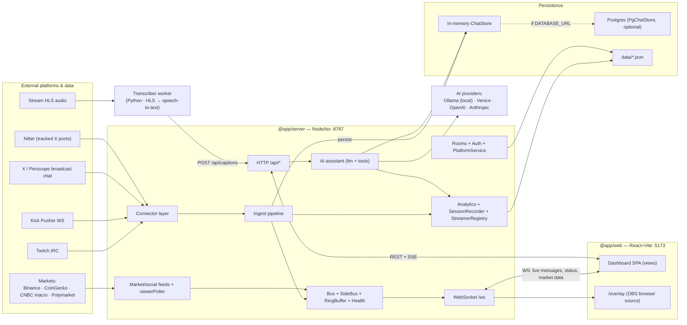
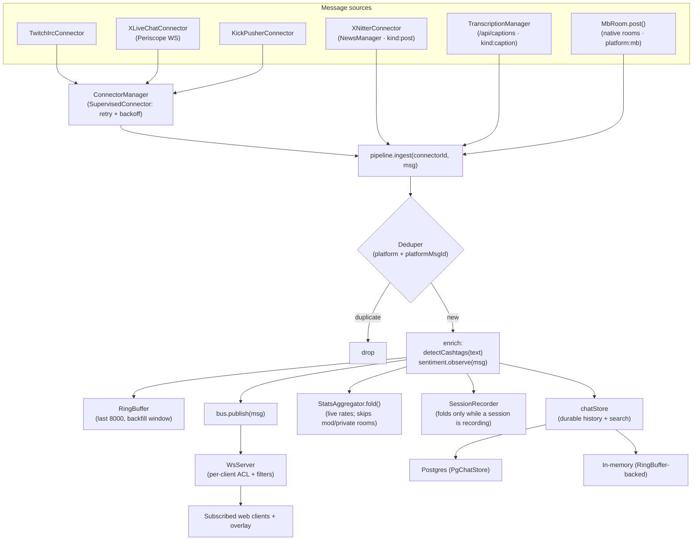
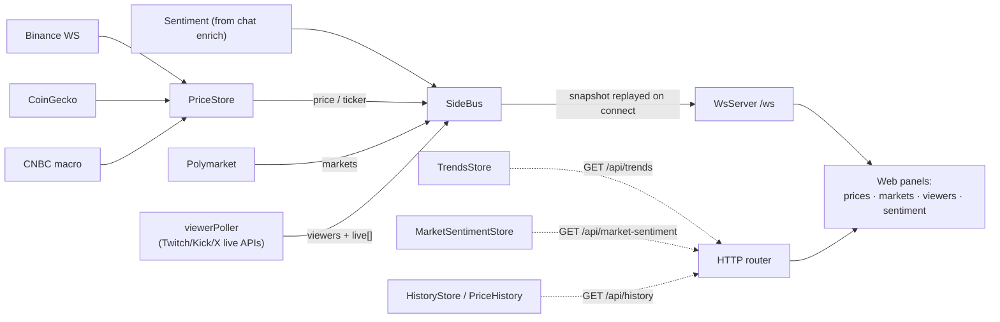
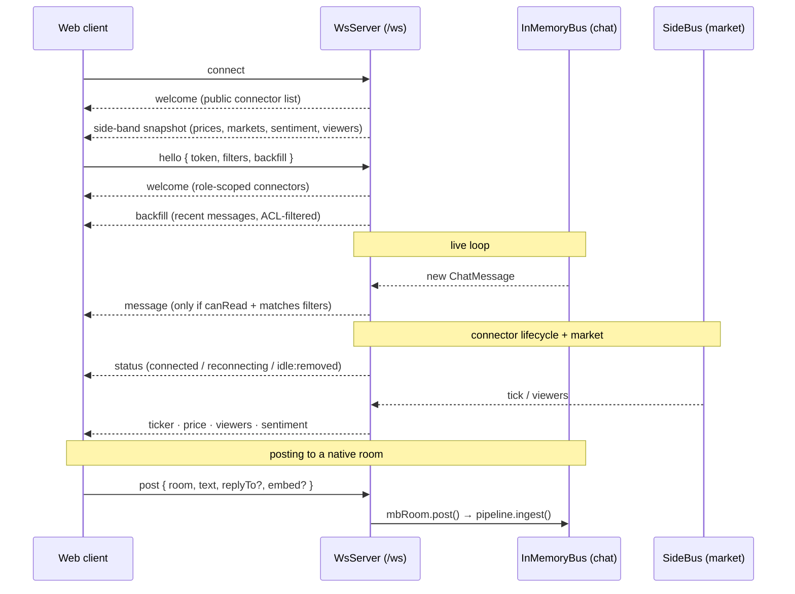
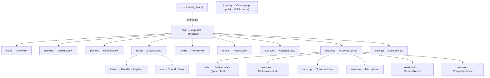
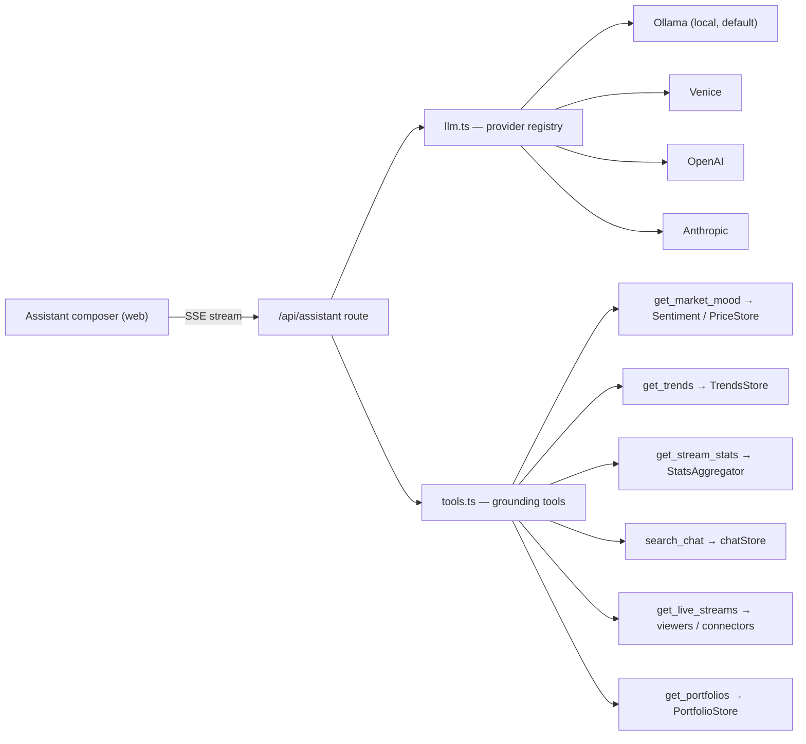

# MarketBubble — Architecture

A trading-streamer command center. pnpm monorepo:

- **`@app/server`** — Node/tsx, port **8787**, no watch (manual restart). Ingests chat from
  Twitch/Kick/X, runs the realtime fan-out, analytics, finance/social feeds, native rooms,
  and the AI assistant.
- **`@app/web`** — React + Vite SPA, port **5173** (HMR). Dashboard + OBS overlay.
- **`@app/shared`** — shared TypeScript types (the `ChatMessage`, envelope, stats contracts).

These diagrams are **Mermaid**. View them in any Mermaid-aware Markdown preview
(VS Code "Markdown Preview Mermaid Support", GitHub, etc.).

---

## 1. System containers (the big picture)

---

## 2. Chat-message ingest pipeline (what happens to every message)

Every message — from a platform connector, a tracked-account tweet, a live caption, or a
native room post — funnels through one `pipeline.ingest()` path: **dedup → enrich → fan out
to ring, store, analytics, recorder, and the live bus**.

---

## 3. Side-band feeds (market / social / viewers)

Market and presence data never touch the chat bus — they ride the **SideBus**, which
snapshots the last message of each type and **replays it to every client on connect** (so a
fresh tab sees prices/markets immediately). Slower aggregates are served over REST.

---

## 4. Realtime WebSocket protocol

---

## 5. Frontend route map

---

## 6. AI assistant grounding

The assistant streams over SSE. It picks a provider (Ollama by default, local-first) and is
"grounded" by a fixed set of tools that read live server state.

> Note: there is currently **no transcript/caption tool** and the assistant reads the **live
> snapshot**, not durable session history. Those gaps are part of the in-progress analytics
> redesign.

---

## Persistence map (where state lives)

| Store | Backing | Survives restart? |
|---|---|---|
| Recent chat (backfill window) | `RingBuffer` (in-memory, 8000) | No (rebuilt from durable on boot) |
| Durable chat + search | `PgChatStore` if `DATABASE_URL`, else in-memory `ChatStore` | Postgres: yes · in-memory: no |
| Live analytics | `StatsAggregator` (in-memory fold) | No (replayed from durable on boot) |
| Recording sessions | `data/analytics/sessions.json` | Yes |
| Native rooms | `data/rooms-dynamic.json` | Yes |
| Streamer identities | `data/streamers.json` | Yes |
| Users / auth | `data/users.json` | Yes |
| OAuth app creds | `data/integrations.json` | Yes |
| Runtime-added sources | `data/sources.json` | Yes |
| Tracked X accounts | `data/tracked.json` | Yes |
| Portfolios | `data/portfolios.json` | Yes |
| Checklists | `data/checklists.json` | Yes |
| Show episodes | `data/episodes.json` | Yes |
| Market caches | `data/sentiment-cache.json`, `data/price-history-cache.json` | Yes |
